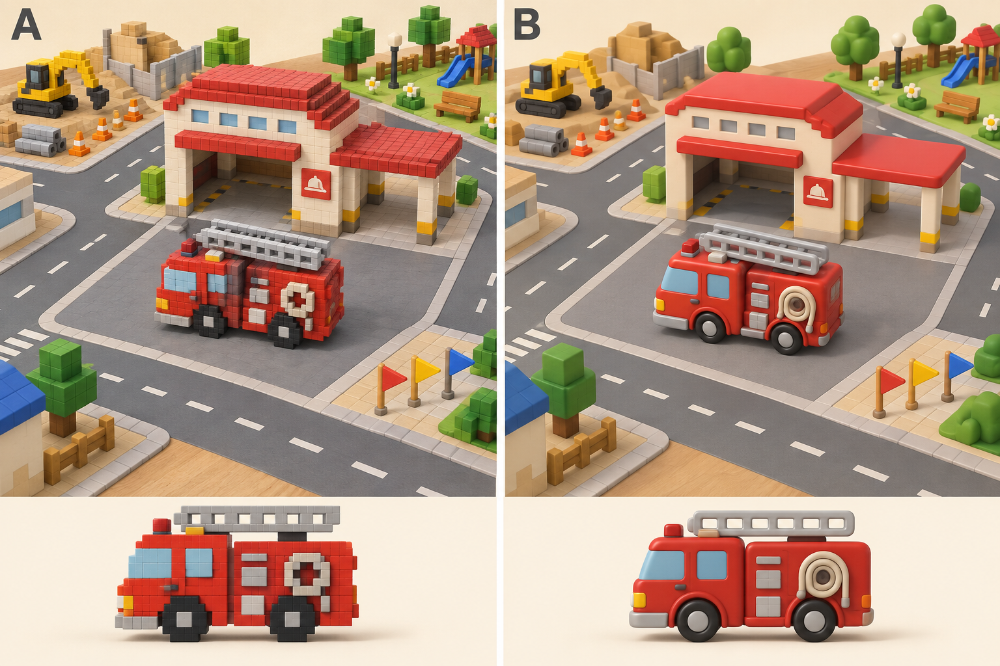

# 街と車体モデルの再構築案

状態: 2026-09-14 A純ボクセル案をユーザー承認。codex/town-model-rebuildで実装・検証中。
比較元: 公開main `013a34e02857dbfb180e3b75c3d191d22d85b753`（製品ソースe25f112）。
ユーザー添付は旧localhost:5183。下記モデル定義は現行にも存在する。

## 本質と調査結果

3歳児が働く車を動かし、仕事をしたり、寄り道して積み木や色水で遊ぶ箱庭。
自由走行・5車種・各3仕事・車庫への帰還/乗換・自由アクションが核となる。

| 観測 | 根拠 | 問題 |
| --- | --- | --- |
| 車庫の背面/右面の壁と屋根縁だけが低い | `src/voxel-game/scene/garageCutaway.ts` | 高さの異なる壁・屋根・入口梁が混在し、建物の構造が伝わらない |
| 車庫の衝突判定は元の高い壁 | `worldCollisionLayout.ts` / `productionWorldMap.ts` | 低く見える壁と通行可能範囲が一致しない |
| 手前の赤黄青は `south-entry-flag-*` | `productionWorldMap.ts` | 支柱も旗の輪郭もない薄い板。非solidなのに壁に見える |
| 赤い支柱は `hub-gate-post` | 同上 | solidの単独柱。門や進入管理の役割を視覚的に説明できない |
| 細長い赤い横棒は `garage-header` | 同上 | 非solidの入口梁。屋根との接続が見えず、空中の障害物に見える |
| 消防車の運転席と後部機器部は同じ高さのshellBox | `src/vehicle-lab/model/fireTruckVoxels.ts` | 俯瞰時に一つの赤い箱として見えやすい。梯子・タイヤ・窓の輪郭を強める余地 |
| 街の多くは用途名の付いた単純boxの組合せ | `productionWorldMap.ts` | IDの意味が画面から伝わるとは限らない。旗・標識・遊具・棚を用途から作る必要 |

README、package、VoxelWorld、車種registry、5車種生成器、衝突定義、既存の要件/検証資料を確認。
React/R3F/Three/Rapier、3入口、GitHub Pages、既存unit/ブラウザ検証は今回の目的に適合しており維持する。
API/backend・保存形式・公開URLの変更は不要。新依存・外部モデル配信サービスは追加しない。

## 世界観辞書と比較案

共通語彙: 木の机、働く車のおもちゃ、クリーム色の建物、赤い救援拠点、落ち着いた道路、歩道、用途が読める道具、黄色の目的地案内。
道路は走る場所、歩道は旗/標識/樹木を置く場所、前庭は車を選んで出発する場所とする。
成功星は仕事完了、道具の動きは自由アクションという既存の意味を維持。HUDの車種絵と実モデルの輪郭を合わせる。

- **A 推奨**: 純ボクセルを維持。大きな形でキャビン、後部、段付きタイヤ、梯子、ブレード、履帯、バケットを区別。セルを増やすだけの高密度化を避ける。
- **B 比較候補**: 丸みのある玩具3Dへ変更。目的と機能は同じだが、純ボクセルという既存の表現方針を変更する。
- 車庫だけの局所修正では、街全体の用途不明な物体や車種識別の問題が残る。

比較画像は生成した方向案であり、実装済み画面・性能・仕様の証明ではない。承認した方向はまず実際の3D画面で成立させ、形・色・カメラの比較後に全地区へ広げる。

## 再構築する内容

1. **中央拠点**: 広い前庭に面した開放型車庫。柱・梁・屋根が接続する構造にし、車は前庭の乗換位置で全体が見える。帰庫判定と乗換の分かりやすさは維持。車庫をカメラに対してどちらへ向けるかは前庭/道路との関係から決める。
2. **街**: 全地区の構造物を「何をする場所か」「どこを通れるか」から再点検。三色旗は支柱付きの旗として道路脇へ。単独ゲート柱は通行を塞がない案内設備へ置換。装飾とsolid形状を共有する部品定義にし、見えない高い壁を残さない。
3. **5車種**: 消防車は運転席と機器室を分け、梯子の隙間・ホース・タイヤを明確に。ブルドーザーは幅広ブレード、ショベルは伸びたアーム/バケット、救急車は箱形救護室、パトカーは低い車体と灯火で識別する。色変更後も道具と輪郭で識別できること。
4. **カメラ/HUD**: 前庭と最大車体を先に配置し、その投影範囲から8px以上の操作余白を確保。主要物を隠してから倍率だけで逃がす設計にしない。

## 既存要件との対応

| 既存要件 | 状態 | 今回の扱い |
| --- | --- | --- |
| REQ-01 5車種/15仕事/自由な遊び | 維持 | 全車種と全仕事、破壊、色水を残す |
| REQ-02 車庫の描画だけ変更・collider固定 | 置換承認済み | A承認により、描画だけのcutawayを廃止し、同じ部品定義で見た目と衝突を揃える |
| REQ-03 車種の絵による選択 | 維持 | 新モデルに合わせて絵の輪郭を同期 |
| REQ-04 全文案内 | 維持 | 道具名・操作可能性との一致 |
| REQ-05 実保持ゲージ | 維持 | 仕事telemetryから算出 |
| REQ-06 キーボード | 維持 | ボタン/IME/編集要素の保護 |
| REQ-07 複合入力 | 維持 | key/pointer所有権とreset/blur解除 |
| REQ-08 寸法対応 | 維持 | 新モデルの実外接寸法で再検証 |
| REQ-09 起動復旧 | 維持 | 失敗/遅延/手動再試行 |
| REQ-10 性能 | 維持 | 現行予算を初期上限とする |
| REQ-11 PR検査 | 維持 | 既存のDocker/CI検証を使用 |
| REQ-12 音の非同期制御 | 維持 | hidden/dispose競合修正を保持 |
| REQ-13 独立レビューと公開 | 維持 | 新版の独立レビューと公開前の確認 |
| REQ-14 用途と形状・通行の一致 | 追加 | 孤立した障害物、旗に見えない壁、支持のない梁をなくす |
| REQ-15 視認性を備えた5モデル | 追加 | 俯瞰/側面/色変更後の車種識別 |

REQ-02の置換理由: 高いcollider固定では開いたように見える車庫との不一致が残る。
影響: 車庫周辺の衝突配置・出発位置・帰庫導線と関連test。代替: 現行colliderのまま表示だけ再修正（建物の視認性と構造に制約）。
復帰条件: 新前庭の帰庫/乗換/出入りが実走で成立しなければ旧版を保持し設計を再検討。2026-09-14のA承認で置換を確定。遊びの機能削除は行わない。

## 実装順と受け入れ条件

1. 方向確認後、現行公開版を比較元として中央拠点・消防車の最小範囲を別作業branchで実装。広範囲の一括置換を避ける。
2. 開口からの出入り・前庭の旋回・帰庫乗換、見た目と衝突の一致、実プレイ視点での消防車識別を確認。
3. 他4車種と全地区へ同じ部品規約を適用。対象の最後の進入路を塞がない。ミッションID/成功条件は維持し、位置変更が必要なら理由と見通しを記録する。
4. 3入口、全15仕事、色水/破壊/自由アクション、14寸法/入力/音/起動復旧を変更影響に応じて検証。ミッション配置変更はunitの見通し検査とDesktop/Mobile landscapeの実プレイ画像を必須とする。
5. 旧版と新版の同地点・同車種・同viewportを比較。数値の余白合格に加えて建物/旗/標識/車種の意味を人が画像で確認し、独立レビューを行う。

受け入れ: 柱梁屋根の接続、走路を横切る用途不明な装飾なし、モデルとsolidの一致、全機能維持、主操作64px/選択56px/補助44px、画面端・物体とHUD8px以上。
非対象: 車種/仕事削減、学習課題化、操作の複雑化、課金、外部API、保存形式、URL/ホスティング/技術スタック変更。
リスク: 大きい道具による遮蔽、新colliderでの行き止まり、色変更での識別低下。実外接寸法・通路幅・進入視点・色変更を比較する。
性能目標: 現行scene34/車体7 draw calls、game350KB/Three750KB/Rapier2.25MBを初期予算にする。予算変更が必要なら測定値と代替案を提示し、勝手に緩めない。Dockerの結果をiOS実機性能や子どもの理解の証明にしない。
公開準備: モデル/配置コードを実装中。本番と依存は未変更。新版の検証結果が揃った段階で再公開を扱う。

## 画像の扱い

ASSET-001: 比較案作成用、A採用、B不採用、`model-directions.png`。生成画像をゲームへ貼り込まず、承認されたモデル形状・配色・空間構成を3D実装で再現するための参照とする。独自の玩具街、商標/既存キャラクターなし。
再生成の要点: 同一の俯瞰カメラ/レイアウト/配色でA純voxelとB丸い玩具を並べる。木の机、クリーム/赤の接続した車庫、開いた前庭に全体が見える消防車、歩道上の支柱付き三色旗、後景に工事と公園。用途不明な赤い棒と道路を塞ぐ旗は禁止。UIなし、車体側面図を下段に併記。

## 実装した構成（2026-09-14）

- 車庫は前庭の西側 `[−9, 0, 6]`、開口は東向き。既存の帰庫・乗換点 `[0, 0.8, 6]` はひと続きの前庭の黄色い駐車枠に維持した。3壁、入口梁、段屋根は接続し、内部でも最大車両の旋回円と0.5unit以上の合計余裕を確保。
- 前庭を地面の高さに揃え、道路の描画をその境界で分割。路面線を駐車枠へ通さない。壁・柱は描画とRapierでcanonical座標を共有する。
- 南入口の板3枚は歩道上の支柱・土台・段付き三角旗へ置換。赤い孤立柱は前庭脇の矢印標識へ変更。道具棚は扉と取っ手のある収納へ。
- 住宅と工事事務所に扉・窓枠・窓、住宅に段屋根、木に冠頂部、クレーンに吊り具、材木に結束帯、標識に両面の矢印を追加。池は遊具と重ならない奥行きへ変更。
- 5台とも既存7materialとpaint/actionの役割を維持。消防車は段差のあるキャビン・ホース・隙間のある梯子、救急車は高い救護室、パトカーは低いボンネット、工事車は履帯の角と道具の輪郭を明確化。ショベルのアームはキャビンより高くした。
- `visualBounds` は静止時だけでなく、道具の下降・バケット回転・灯火拡大の最大範囲を包含する契約へ統一。実voxelの8頂点と実pose関数で検査する。
- 広い画面では仕事札を左右の運転ボタンの間へ配置。車体と8px以上の余白を実測し、車庫と周辺道路を一緒に見渡す。小さい画面は上部案内を維持。
- 固定物の色をinstance属性へまとめ、装飾の増加で色ごとのdraw callが増えない構成へ変更。

位置を変更したのは車庫と案内設備、池の寸法。西の巡回案内は車庫の前を経由して南へ進む経路にした。15仕事のID・対象位置・成功条件、帰庫中心、保存形式、入口URL、音と入力の挙動は維持。生成比較画像は方向参照であり、完成画面ではない。

検証結果と実画像は `verification.md` に記録する。Docker browserでの検証をiPad実機や3歳児の理解確認とは扱わない。
