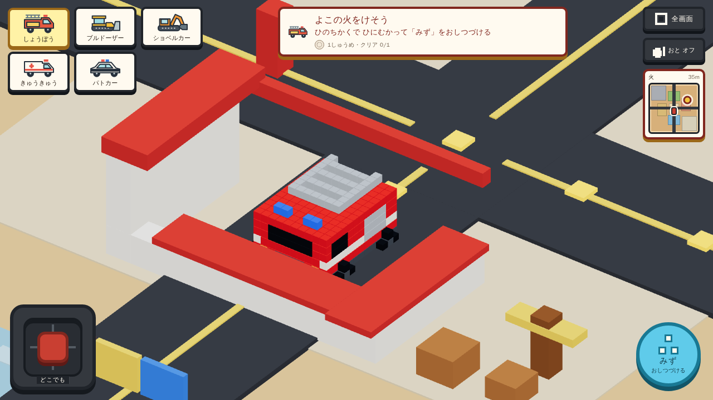
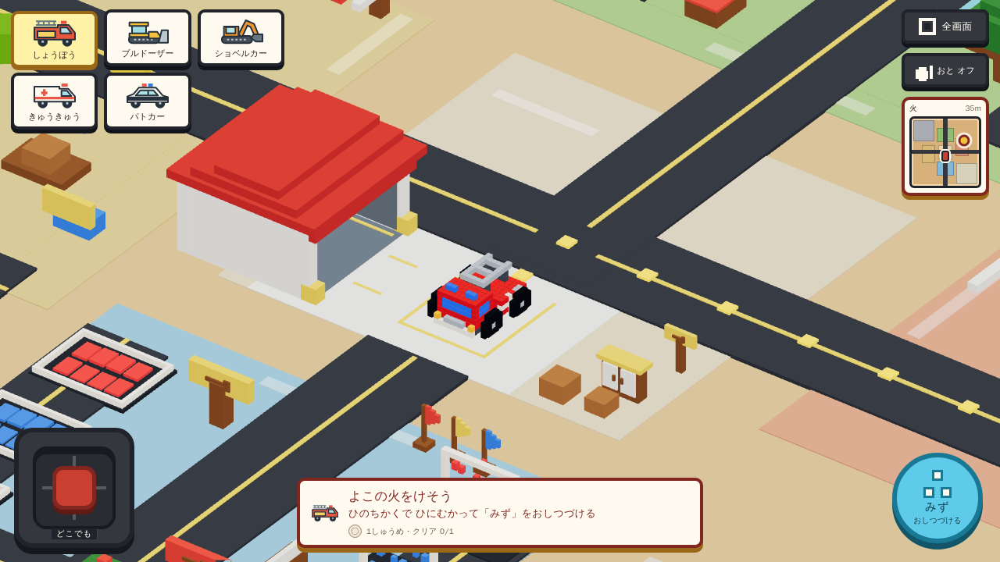

# 街・車体再構築の検証

比較元: `013a34e02857dbfb180e3b75c3d191d22d85b753`。実行環境: Docker `newproject-voxel-game-e2e:latest`、Chromium/SwiftShader、本番ビルドの固定preview。開発サーバのHMR中に取得した途中結果は採用しない。

## 採用した変更と回帰防止

- 車庫は前庭の西側へ置き、東向き開口・同じ地面高さで接続。全5車種の旋回直径、開口の前庭への接続、車体の投影を壁が遮らないことをunitで検査する。
- 描画専用cutawayを廃止し、壁と当たり判定の同一座標を維持。三色の壁状装飾は歩道上の三角旗、孤立した赤い支柱は矢印案内へ変更した。
- 5車種の窓・車高差・タイヤ・作業道具を見直した。外接寸法は実ボクセルの8頂点と実アクションの変換順・位相境界を検査し、動作中にも収まるようにした。
- 固定物は色別の複数描画からinstance colorによる1描画へまとめた。場面の描画予算34、車体7、既存の配信サイズ予算を維持する。
- 15仕事のID・対象位置・成功条件は維持。西側の巡回案内は車庫の前を通って南へ迂回する。

## 実測結果

| 検証 | 結果・範囲 |
| --- | --- |
| Unit / production build | 559 tests PASS。TypeScript、Vite、配信サイズ予算 PASS |
| 入庫・方向転換・出庫・乗換復帰 | 5車種 × 1280×720 / 844×390 の10ケース PASS。通常DOMスティック入力、resetなし。`scripts/verify-town-depot.mjs` |
| 描画コスト | 入出庫10ケースの最大scene29、7地区の最大scene30 draw calls、車体7。SwiftShaderの描画回数であり実機FPSの主張ではない |
| HUD・入力 | 24サイズ×5車種を実測。最終の13サイズ65件と入力8系統は同一runでPASS、faults/errorsなし。他の変更非該当サイズは先行成功証拠を再利用 |
| 仕事・自由遊び | 非消防12仕事の実走PASS（remaining7、fleet3、bulldozer北/西2）。帰庫・次仕事・乗換、色水/シャワーの起動・上書き・期限・復元もPASS。消防3仕事の最終再実走結果はPR #6本文へ記録 |
| 7地区・代表衝突 | Desktopの7地区への実移動、画像目視、主要物とHUDの分離、scene34予算PASS。新車庫2壁と案内柱は各60接触frame、reset0、貫通なし、離脱成功 |
| 3入口・音・復旧 | PR #6のBrowser smokeが3入口・14境界サイズ・入力・3サイズ×5車種の実AudioContextを検査する。最終結果は同PRのChecksを参照。音/復旧コードは今回変更せず、復旧7経路は既存の検証証拠を再利用 |
| 独立レビュー | 画像・コードの独立レビューともAPPROVED。入口が白く同化する指摘と、旧車庫方向を前提にした検証の進入・転回経路を修正。対象3衝突の独立実走もPASS |

`output/town-rebuild/depot/report.json` と同フォルダの画像が入出庫証拠。内装を含む画像は `VoxelGameApp-Cd1oW6Kh.js`、360px縦画面の倍率を追加調整した最終製品のゲームchunkは `VoxelGameApp-a91tFfJP.js`。1280×720の形状・カメラは両buildで同一。`output/` はローカル証拠置場としてgit除外される。

## 途中で検出・修正した問題

1. 北西車庫と前庭の間を道路が横切る構成は、ひと続きの拠点に見えないため不採用。西側の東向き開口へ修正した。
2. 内壁と床が外壁と同じ白で入口が読めなかったため、内装に暗い色を付けた。入庫すると屋根に車体が隠れるが、帰庫・乗換位置は全体が見える前庭に維持している。
3. ショベルの高いアームを含む外接範囲で667×375のHUD余白不足を検出し、低い画面のカメラ倍率を修正した。
4. 縦画面の2段selectorが360×721で車体に重なったため、1段を780pxまで継続。640×481の横画面への縦レイアウト漏れはorientation条件で修正。780/781双方も画像と数値で検証した。
5. 旧車庫を前提とした実走ハーネスと、キーボードの長距離斜行で壁へ接触する巡回経路を修正。巡回門への精密進入は既存のDOMスティックドライバを使用し、reset・完了条件は緩めていない。
6. 固定物を色ごとに描画すると予算を超えたためinstance colorへ集約。配色を白材質との乗算で保ち、描画予算は変更していない。

## 証拠の限界

Docker browser、DOM pointer入力、画面寸法の再現は物理iPad・iPhoneでの実操作ではない。実機GPU性能、実際に聞こえる音、3歳児が用途を理解できるかは未確認。生成した比較画像は方向案であり、実装や受け入れの証明には使用しない。

公開URLとホスティングは既存GitHub Pagesを維持する。公開前の版へ戻す必要があれば、この変更のmergeをrevertし同じPages workflowで再配信する。

## 比較画像と最終リリース記録

同一1280×720・job-seed=1・初期位置の実ブラウザ画像。モデル比較用の生成画像とは区別する。

最終の実走結果・CI・公開状況は[PR #6](https://github.com/santa928/toy-rescue-course/pull/6)に記録する。
