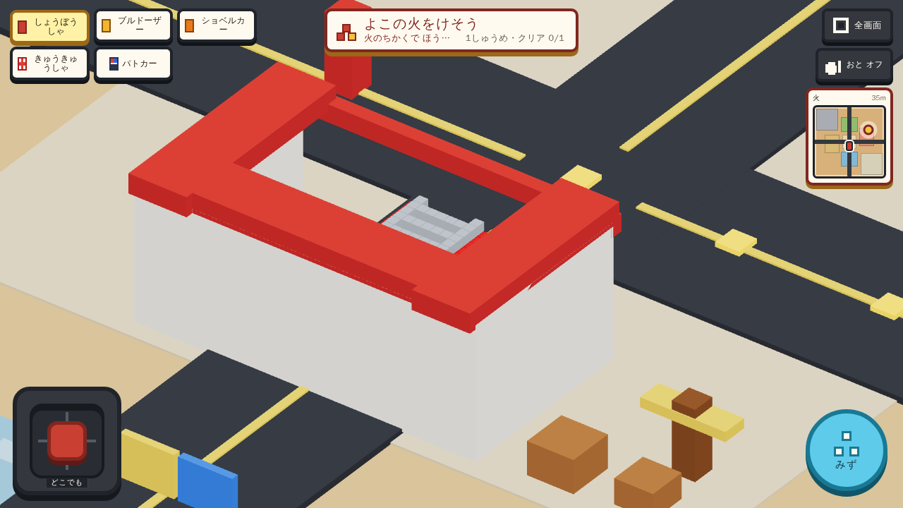
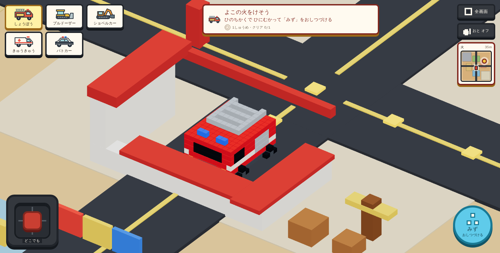
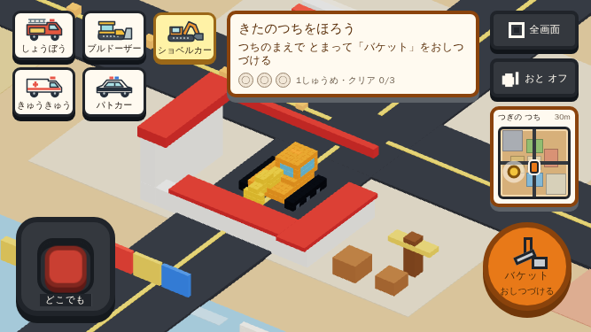
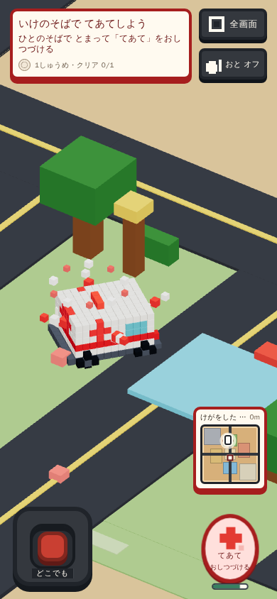
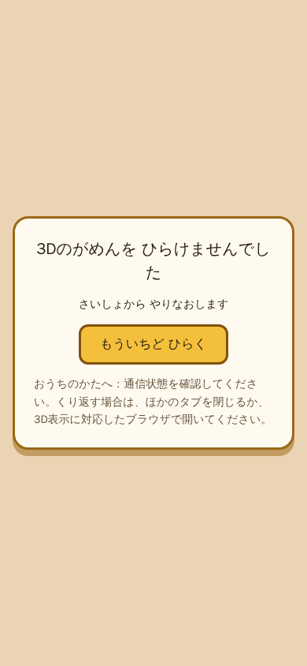

# 初見体験の改善と検証記録

[Issue #4](https://github.com/santa928/toy-rescue-course/issues/4) / [PR #5](https://github.com/santa928/toy-rescue-course/pull/5)

製品を開いた直後の車体・車種選択・操作案内と、複合入力・起動復旧を改善した。
5車種、全15仕事、自由走行、積み木破壊、色水、自由アクションを維持する。

## 対象と証拠の境界

- 変更前: `63417398af506aa5ee8f2a7e82d5d786231fcec3`
- 9月12日の製品修正: `c6b8d3dd145b84a056123f1cbb627e8ec84c2d5c`。このディレクトリの画像・JSONは`836b7e2`で保存した当時の証拠。
- 現行製品の最終修正: `e25f11270a4c6e0d83d9972caf813c17baa1bce0`。PR #5のmerge commitは`5ac336fb2cd23f3f521a9d6c7827353a3a243b92`。
- 実行: 9月12日はmacOS上のDocker、9月13日はGitHub ActionsのPlaywright Docker container。Playwright 1.59.1、Chromium、ANGLE/SwiftShader。
- 通常走行はkeyboardまたはpointer操作。追加7仕事はreset/teleportなしをassertする。
- ここに保存したlayout画像・fleet/vehiclesは9月12日のUIで測定した。9月13日にcamera倍率・短い画面の選択欄・ミニマップ幅・音のライフサイクルを追加修正したため、これらの最新UI/音の証拠には使わない。仕事配置・車両物理は維持している。
- 9月12日のinputはreset修正後。unit・Node・音・色水・消防・衝突・mapは`82e9379`の製品ソース。代替文除去はrecovery・型検査/build・入口smokeで確認した。変更のない物理・仕事経路は成功証拠を再利用し、全検査を最新SHAで実行したとは扱わない。
- 現行e25f112では[PR checks](https://github.com/santa928/toy-rescue-course/actions/runs/34762583787)と[Docker browser smoke](https://github.com/santa928/toy-rescue-course/actions/runs/34762583762)が成功。536 unit、38 Node helper、build、3入口、14寸法×5車種の70レイアウト、入力8系統、3寸法×5車種の実AudioContext/mixを再検証した。最新画像・生データは同runのartifactを参照（保存7日）。
- 画像・数値はCodexが取得したもの。Proによる画像確認や独立レビューの完了を意味しない。
- 実際の発音の聴取、物理GPU、iOS実機、子どもの理解度は未測定。DockerのfpsやAudioContext状態で代替しない。

## 画面

変更前のDesktop:

変更後のDesktop。車庫の背面・右面だけ描画を低くし、車体を見えるようにした。衝突boxの位置・寸法・回転は維持する。

667×375の横画面。車種・全文案内・運転・道具の領域を分離する。

390×844の縦画面で救急の作用中。道具の押下表示と、実際に対象へ作用している保持バーを区別する。

WebGL初期化失敗。入力を停止し、再試行時の進捗初期化を表示する。

## 9月12日の検証結果（現行の再検証結果は冒頭参照）

| 確認 | 結果・証拠 |
| --- | --- |
| unit / Node helper / 型検査・build | 当時の51ファイル531件 / 38件 PASS。c6b8d3dのbuildはgame 187,913 bytes、Three 718,551 bytes、Rapier 2,237,128 bytesで既存予算内 |
| 初期レイアウト | 7寸法×5車種=35組 PASS。[実寸・車体投影・描画call](layout-report.json)。端とHUD間8px、選択56px以上、文字欠けなし |
| 入力 | [8系統 PASS](input-report.json)。同義キー、両解放順、native Space/Enter、focus変更、reset、実mouse capture、blur。IME/修飾キーは合成event検査 |
| 複合touch | CDPで2本指の移動＋道具、cancel、4方向 PASS。物理タッチ端末とは区別 |
| 起動・復旧 | [7ケース PASS](recovery-report.json)。module/scene/WebGL/context loss/遅延/no-JS。再試行で回復するケースと原因が残るケースを検査。context loss後の実AudioContext closedも確認 |
| 5車種・全15仕事 | 下表の全仕事に到達し、完了を確認。代表仕事は帰庫・次仕事・再選択まで確認 |
| 音 | [Desktop/Tablet/Mobile landscapeで5車種の操作、AudioContext lifecycle PASS](audio-report.json)。音の聴取評価は含まない |
| 色水 | [Desktop/Tablet/Mobile landscapeで色取得・切替・復元、6枚のHUD画素検査 PASS](colors-report.json) |
| 積み木 | 赤い積み木の衝突・破片運動・復元 PASS |
| カメラ | 既存camera stabilityの3寸法 PASS |
| 衝突 | [車庫の両壁・道路の柱・建物・樹木・遊具・火災障害物、非solid道しるべの通過 PASS](collision-report.json) |
| 地区移動 | [Desktopのconstruction/townへの通常操作、scene 34 calls / 車体7 calls PASS](map-report.json) |
| 本番入口 | `/`・`/voxel-game.html`・`/vehicle-lab.html` PASS。公開URLへのデプロイは未実施 |

全15仕事のカバレッジ:

| 車種 | 完了した仕事ID | 証拠の取得経路 |
| --- | --- | --- |
| 消防車 | fire-side / fire-hydrant / fire-planter | [canonical nonbreak](fire-report.json)のDesktop/Tablet/Mobileで3仕事循環 |
| ブルドーザー | debris-north / debris-west / debris-south | [vehicles portrait](vehicles-report.json)で2仕事、additional jobsで南 |
| ショベルカー | soil-north / soil-south / soil-west | [fleet](fleet-report.json)で北、additional jobsで南・西 |
| 救急車 | patient-pond / patient-playground / patient-picnic | fleetで池、additional jobsで遊具・広場 |
| パトカー | patrol-main / patrol-pools / patrol-showers | fleetで中央、additional jobsで池・シャワー |

[追加7仕事の完了時生データ](additional-jobs-report.json)。仕事seedは1、5376、10752。

## 再現方法

開発・検証はDocker内で行う。`docker compose --profile e2e build voxel-game-e2e`でイメージを作成する。
単体検証は `npm test`、`node --test scripts/*.node-test.mjs scripts/voxel-game-e2e/*.node-test.mjs`、`npm run build`。
これらをホストで実行しない。

ブラウザ検証は `VOXEL_GAME_BASE_URL` にDockerから到達可能なプレビューURLを指定して、以下をDocker内で実行する。

- `node scripts/verify-product-usability.mjs`（既定7寸法・入力。最新CIは`USABILITY_VIEWPORTS`で14寸法を指定。入力だけは `USABILITY_INPUT_ONLY=1`）
- `node scripts/verify-game-recovery.mjs`（障害注入のためVite開発サーバを使う）
- `node scripts/verify-remaining-vehicle-jobs.mjs`（追加7仕事。`JOB_FILTER`で仕事IDを絞れる）
- `node scripts/verify-voxel-game-fleet.mjs`、`node scripts/verify-voxel-game-vehicles.mjs`
- `node scripts/verify-fullscreen-swipe-drive.mjs`、`node scripts/verify-world-camera-stability.mjs`
- `node scripts/verify-voxel-game-audio.mjs`、`node scripts/verify-voxel-game-colors.mjs`
- `VOXEL_GAME_FOCUS=nonbreak node scripts/verify-voxel-game.mjs`（collision / break-redも個別実行）
- `node scripts/verify-production-entrypoints.mjs`

全15仕事を同じviewportへ重複展開することや、全積み木色・全実機のrelease matrixは行っていない。
物理・仕事配置を変更しておらず、今回の入力・描画・起動変更を検出するシナリオから検証した。

## 性能比較

[同じDockerで変更前後を交互に3回測定した生データ](performance-report.json)。1280×720、seed 1、warmup 2秒、各12秒。
median fpsはbaseが59.88 / 30.12 / 30.12、最終版が59.52 / 59.52 / 30.12。p10は全回29.94だった。
環境内の変動が大きく、この値から高速化や物理GPU性能の合格を主張しない。描画call・配信サイズの既存予算は維持した。

## 試験側の補正と未測定事項

色水E2Eの古い期待値5 callsを、baseの製品・unitに既に存在する1 callへ同期した。許容値を緩める変更ではない。
追加仕事は道具棚・シャワー支柱・積み木を避ける通常経路へ検証scriptを修正した。製品の対象配置や成功条件は変更していない。
最初の消防Tablet試験は精密停止座標で失敗したが、同じ許容誤差を維持した再実行で3viewportすべて完了した。

## レビューと公開

同じ[ProのChat](https://chatgpt.com/c/6aa4df60-ee34-83ee-a5a5-54bd7aa60397)へPRレビューを依頼したが、利用上限の表示で実行できなかった。
2026-09-13にユーザーがサブエージェントの独立レビューを代替として指定し、必須指摘を解消した後のPages公開まで許可した。
同じIssue #4・branch・PR #5を維持する。レビューで見つかった480px境界のcamera倍率急増と、音ON中のタブ非表示の競合を修正し、境界viewportと非同期audio回帰を追加した。
公開前は最新headのCI・独立再レビュー、公開後はPages URLに対するDockerブラウザ検証を行う。判定SHAと実行結果はPR #5に記録する。
